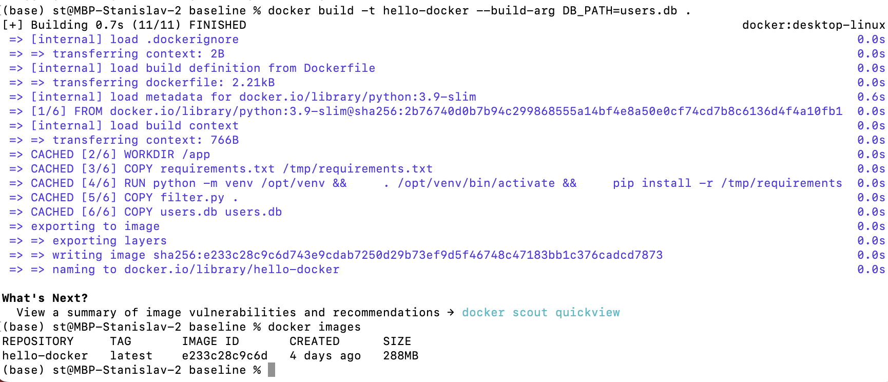

# Лабораторная работа №1 "Работа с Dockerfile"

## Выполнил: 
Самсонов Станислав K34202

## Цель работы:
Написать два Dockerfile - плохой и хороший.

## Задачи:
* Написать плохой Dockerfile и описать плохие практики, которые в нем используются
* Написать хороший Dockerfile, где будут исправлены плохие практики

## Ход работы

### Dockerfile_bad

В первую очередь был создан файл Dockerfile_bad, в котором описаны работающие, но при этом не самые лучшие практики реализации Dockerfile.

1.  В плохом Dockerfile новый образ будет построен поверх образа Apache Airflow и использованием Python. Это может быть плохой практикой, так как создается более крупный образ из-за множества установленных компонентов и дополнительных зависимостей

```
FROM apache/airflow:2.0.0-python3.8
```

2. Использовать несколько команд ADD, вместо объединения их в одну. Инструкции создают новый слой контейнера, а потому группировка нескольких команд вместе уменьшит количество слоев.

```
RUN apt-get update && \
    apt-get upgrade -y && \
    apt-get -y install --no-install-recommends git libpq5 libgomp1 curl && \
    rm -rf /var/lib/apt/lists/*

RUN python -m venv /opt/venv
RUN . /opt/venv/bin/activate
RUN pip install -r /tmp/requirements.txt
```

3. Контейнер выполняется с правами root, что может представлять риск с точки зрения безопасности. Лучше создать нового пользователя и назначить ему необохдимы права.

* Запуск "плохого контейнера"



### Dockerfile_good

Далее был создан Dockerfile_good в котором исправлены плохие практики.

1. Используется в качестве исходного образа python:3.8-slim. Тут и версия указана конкретная, и сам образ меньше, но при этом все необходимые функции сохраняются.

```
FROM python:3.8-slim
```

2. Объединены все команды ADD в одну, чтобы не плодить лишние слои.

```
RUN python -m venv /opt/venv && \
    . /opt/venv/bin/activate && \
    pip install -r /tmp/requirements.txt
```

3. Создан новый пользователя, от лица которого будет запускатьяс исполняемый файл.

```
RUN useradd -m stasko
USER stasko
```

### Плохие практики использования контейнера:
Использование неопределенных версий образов. Если контейнер зависит от конкретной версии образа, необходимо явно указывать эту версию в файлах развертывания.
Использование нескольких процессов в одном контейнере. Запуск нескольких процессов в одном контейнере может сделать его трудным для управления и масштабирования. Каждый контейнер должен выполнять только один процесс, а для взаимодействия между контейнерами следует использовать сетевые механизмы Docker.
## Вывод:
В ходе выполнения лабораторной работы были созданы два Dockerfile: плохой, с использованием плохих практики, и хороший, где эти плохие практики были исправлены. Оба контейнера были успешно созданы и запущены.
